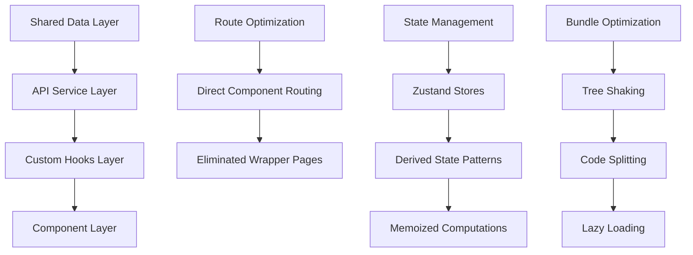

# Design Document

## Overview

This design document outlines a comprehensive optimization strategy for the Steel Vault application to eliminate code redundancy, simplify over-complex components, optimize data fetching patterns, and improve overall performance while maintaining all existing functionality. The optimization focuses on creating a more maintainable, performant, and developer-friendly codebase.

## Architecture

### Current Architecture Issues

- Duplicate API calls across components (fetch('/api/users/me') appears 15+ times)
- Wrapper page components that only render other components
- Excessive useState hooks causing unnecessary re-renders
- No centralized data fetching or caching strategy
- Inconsistent error handling patterns
- Large bundle size due to unused code and inefficient imports

### Optimized Architecture



## Components and Interfaces

### 1. Centralized API Service Layer

**Purpose:** Eliminate duplicate API calls and provide consistent data fetching patterns

**Interface:**

```javascript
class ApiService {
  static async getUser()
  static async getProjects(clientId?)
  static async getClients()
  static async uploadFile(file, options)
  static async bulkOperation(endpoint, data)
}
```

**Implementation:**

- Single source of truth for all API calls
- Built-in caching with SWR or React Query
- Consistent error handling and retry logic
- Request deduplication for concurrent calls

### 2. Custom Hooks for Data Management

**Purpose:** Replace repetitive useEffect + useState patterns with reusable hooks

**Interface:**

```javascript
// Replace 15+ individual fetch calls
const useCurrentUser = () => ({ user, loading, error, refetch });
const useProjects = (clientId) => ({ projects, loading, error });
const useClients = () => ({ clients, loading, error });
const useDocumentLogs = (projectId) => ({ logs, loading, error });
```

**Implementation:**

- Centralized data fetching logic
- Automatic caching and revalidation
- Loading and error state management
- Optimistic updates where appropriate

### 3. Simplified Component Architecture

**Purpose:** Eliminate unnecessary wrapper components and simplify complex components

**Current Issues:**

```javascript
// Unnecessary wrapper - 20+ similar files
const publishDrawingPage = () => {
  return <PublishDrawing />;
};
```

**Optimized Approach:**

```javascript
// Direct routing in app router
// app/dashboard/project/project/publish-drawings/page.jsx
export { default } from "@/components/ProjectComponent/PublishDrawing";
```

**Implementation:**

- Remove 30+ wrapper page components
- Consolidate similar form components
- Extract reusable UI patterns
- Simplify complex state management

### 4. Optimized State Management

**Purpose:** Reduce unnecessary re-renders and simplify state logic

**Current Issues:**

```javascript
// Over-complex state in PublishDrawing.jsx (50+ useState calls)
const [uploadedExcelFiles, setUploadedExcelFiles] = useState([]);
const [activeTab, setActiveTab] = useState("Drawings");
const [excelFileData, setExcelFileData] = useState([]);
// ... 47 more useState calls
```

**Optimized Approach:**

```javascript
// Consolidated state with useReducer
const [state, dispatch] = useReducer(publishDrawingReducer, initialState);
// Or derived state patterns
const derivedStats = useMemo(() => calculateStats(drawings), [drawings]);
```

**Implementation:**

- Replace excessive useState with useReducer for complex state
- Use derived state for computed values
- Implement proper memoization strategies
- Optimize re-render patterns

### 5. Bundle Optimization Strategy

**Purpose:** Reduce bundle size and improve loading performance

**Optimizations:**

- Tree shake unused code from large libraries
- Implement code splitting for route-based chunks
- Lazy load heavy components and libraries
- Optimize asset loading and caching

**Implementation:**

```javascript
// Code splitting for heavy components
const PublishDrawing = lazy(() =>
  import("@/components/ProjectComponent/PublishDrawing")
);
const TransmittalForm = lazy(() =>
  import("@/components/ProjectComponent/TransmittalForm")
);

// Optimized imports
import { debounce } from "lodash/debounce"; // Instead of entire lodash
```

### 6. Standardized Error Handling

**Purpose:** Provide consistent error handling across the application

**Interface:**

```javascript
class ErrorHandler {
  static handleApiError(error, context)
  static showUserError(message, type)
  static logError(error, context)
  static createErrorBoundary(fallback)
}
```

**Implementation:**

- Global error boundary for unhandled errors
- Consistent API error handling
- User-friendly error messages
- Error logging and monitoring

## Data Models

### Simplified State Models

```javascript
// Instead of 50+ individual state variables
const PublishDrawingState = {
  ui: {
    activeTab: "drawings",
    loading: false,
    selectedRows: Set(),
    modals: { show: false, type: null, data: null },
  },
  data: {
    drawings: [],
    extras: [],
    models: [],
    projects: [],
    packages: [],
  },
  form: {
    selectedClientId: null,
    selectedProjectId: null,
    selectedPackageId: null,
  },
};
```

### Optimized API Response Models

```javascript
// Standardized API responses
const ApiResponse = {
  data: any,
  loading: boolean,
  error: string | null,
  meta: {
    total?: number,
    page?: number,
    hasMore?: boolean
  }
}
```

## Error Handling

### Centralized Error Management

- Global error boundary for React errors
- API error interceptors with retry logic
- User-friendly error message translation
- Error logging with context information

### Performance Error Prevention

- Memory leak detection and prevention
- Bundle size monitoring and alerts
- Performance regression testing
- Resource usage monitoring

## Testing Strategy

### Component Testing

- Test simplified components with fewer dependencies
- Mock centralized API services consistently
- Test error handling scenarios
- Validate accessibility improvements

### Performance Testing

- Bundle size regression testing
- Runtime performance monitoring
- Memory usage validation
- Loading time benchmarks

### Integration Testing

- Test data flow through simplified architecture
- Validate error handling across components
- Test state management optimizations
- Ensure backward compatibility

## Security Considerations

### Simplified Security Model

- Centralized authentication state management
- Consistent API security patterns
- Reduced attack surface through code elimination
- Improved error handling without information leakage

## Performance Targets

### Bundle Size Targets

- Reduce main bundle by 30-50%
- Implement effective code splitting
- Achieve < 3 second initial load time
- Optimize asset loading and caching

### Runtime Performance Targets

- Reduce component re-renders by 60%
- Improve list rendering performance
- Achieve < 100ms interaction response times
- Optimize memory usage patterns

### Development Experience Targets

- Reduce component complexity by 50%
- Eliminate 90% of code duplication
- Improve build times by 25%
- Enhance debugging and error tracking

## Migration Strategy

### Phase 1: Infrastructure Setup

- Implement centralized API service layer
- Create custom hooks for common patterns
- Set up error handling infrastructure
- Establish performance monitoring

### Phase 2: Component Simplification

- Remove wrapper page components
- Consolidate duplicate functionality
- Optimize state management patterns
- Implement bundle optimization

### Phase 3: Performance Optimization

- Implement lazy loading and code splitting
- Optimize rendering performance
- Add performance monitoring
- Fine-tune caching strategies

### Phase 4: Testing and Validation

- Comprehensive testing of optimizations
- Performance regression testing
- User acceptance testing
- Documentation updates

## Backward Compatibility

### Preserved Functionality

- All existing features remain functional
- API endpoints maintain compatibility
- User data and preferences preserved
- Existing integrations continue working

### Migration Considerations

- Gradual rollout of optimizations
- Fallback mechanisms for critical paths
- Monitoring for regression detection
- Rollback procedures if needed
