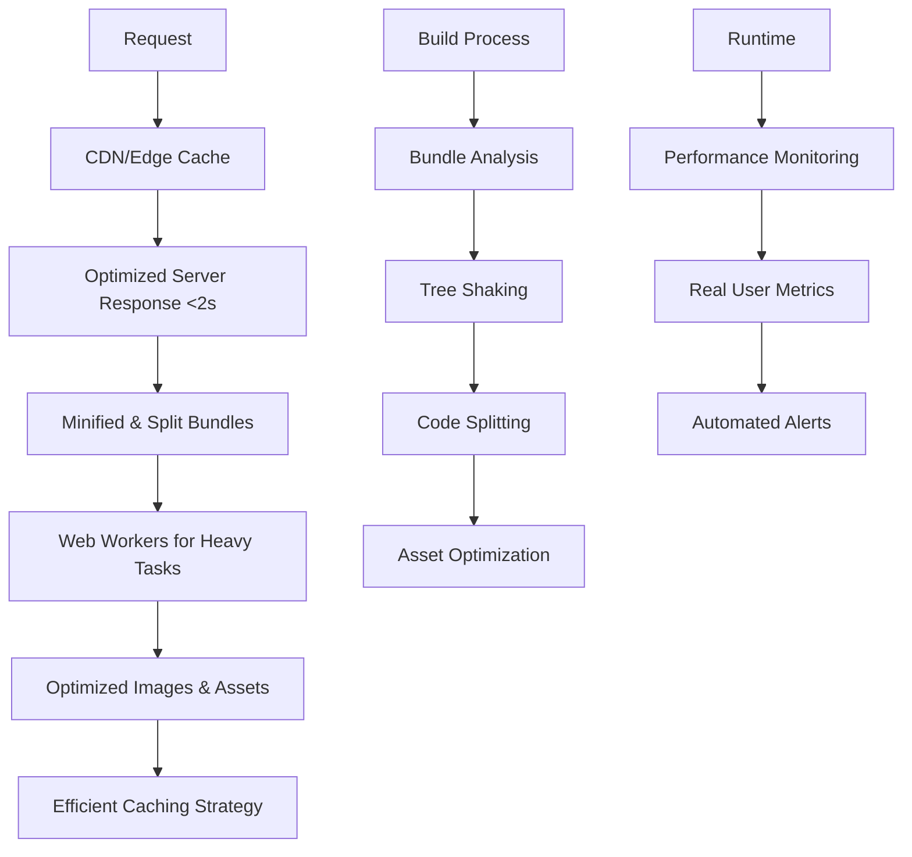

# Design Document

## Overview

This design document addresses the critical performance issues identified in the Lighthouse audit: 9.3-second server response time, 430ms Total Blocking Time, 97KB unused JavaScript, and poor caching. The solution implements targeted optimizations to achieve sub-2-second load times and responsive user interactions.

## Architecture

### Current Performance Issues Analysis

- **Server Response Time**: 9.3 seconds (target: <2s)
- **Total Blocking Time**: 430ms (target: <100ms)
- **Unused JavaScript**: 97KB (62KB from layout.js, 35KB from React DevTools)
- **Unminified JavaScript**: 5KB savings available
- **Legacy JavaScript**: 10KB of unnecessary polyfills
- **Oversized Images**: 13KB savings from SO_logo.png (1080x208 → 313x60)
- **Long Main Thread Tasks**: 4 tasks, longest 505ms
- **Back/Forward Cache**: Blocked by WebSocket and cache-control headers

### Optimized Architecture



## Components and Interfaces

### 1. Server Response Optimization

**Purpose:** Reduce server response time from 9.3s to <2s

**Root Cause Analysis:**

- Database connection delays
- Inefficient query patterns
- Missing database indexes
- Synchronous processing blocking response

**Implementation Strategy:**

```javascript
// Optimized API route structure
class OptimizedApiHandler {
  async handleRequest(req, res) {
    // 1. Immediate response for UI updates
    res.status(200).json({ status: "processing", jobId });

    // 2. Background processing
    await processInBackground(jobId, data);
  }
}
```

**Key Optimizations:**

- Database connection pooling
- Query optimization and indexing
- Response streaming for large data
- Background job processing
- CDN integration for static assets

### 2. JavaScript Bundle Optimization

**Purpose:** Eliminate 97KB unused JavaScript and optimize loading

**Current Issues:**

```javascript
// Problem: Large layout.js bundle (126KB, 62KB unused)
import * as everything from "large-library";

// Problem: Unnecessary polyfills for modern browsers
// @babel/plugin-transform-classes, Array.prototype.at, etc.
```

**Optimized Approach:**

```javascript
// Solution: Tree shaking and specific imports
import { debounce } from "lodash/debounce";
import { format } from "date-fns/format";

// Solution: Modern browser targeting
// Remove unnecessary polyfills for ES2020+ features

// Solution: Code splitting
const PublishDrawing = lazy(() => import("./PublishDrawing"));
const TransmittalForm = lazy(() => import("./TransmittalForm"));
```

**Implementation:**

- Configure Webpack for aggressive tree shaking
- Update Babel config to target modern browsers
- Implement route-based code splitting
- Remove React DevTools from production builds

### 3. Main Thread Optimization

**Purpose:** Reduce Total Blocking Time from 430ms to <100ms

**Current Long Tasks:**

- main-app.js: 505ms (3,093ms start time)
- publish_drawings/page.js: 86ms
- webpack scheduler: 86ms

**Optimization Strategy:**

```javascript
// Problem: Synchronous heavy processing
function processLargeDataset(data) {
  // Blocks main thread for 500ms+
  return data.map((item) => heavyComputation(item));
}

// Solution: Chunked processing with scheduler
function* processLargeDatasetChunked(data) {
  const chunkSize = 100;
  for (let i = 0; i < data.length; i += chunkSize) {
    yield data.slice(i, i + chunkSize).map((item) => heavyComputation(item));
  }
}

async function processWithScheduler(data) {
  const processor = processLargeDatasetChunked(data);
  const results = [];

  for (const chunk of processor) {
    results.push(...chunk);
    // Yield control back to browser
    await new Promise((resolve) => setTimeout(resolve, 0));
  }

  return results;
}
```

**Implementation:**

- Move heavy computations to Web Workers
- Implement time-slicing for large operations
- Use React's concurrent features
- Optimize component rendering patterns

### 4. Asset Optimization System

**Purpose:** Optimize images and assets for faster loading

**Current Issues:**

- SO_logo.png: 14.6KB (1080x208) displayed as 313x60
- No modern image format support
- Missing responsive image implementation

**Optimized Implementation:**

```javascript
// Automated image optimization pipeline
class ImageOptimizer {
  static async optimizeImage(imagePath, displaySizes) {
    const formats = ["avif", "webp", "png"];
    const optimized = {};

    for (const format of formats) {
      optimized[format] = await this.generateResponsiveImages(
        imagePath,
        displaySizes,
        format
      );
    }

    return optimized;
  }
}

// Usage in components
<picture>
  <source srcSet="/SO_logo.avif" type="image/avif" />
  <source srcSet="/SO_logo.webp" type="image/webp" />
  
</picture>;
```

**Implementation:**

- Automated image optimization in build process
- Generate multiple formats (AVIF, WebP, PNG)
- Implement responsive images with srcset
- Add proper width/height attributes to prevent CLS

### 5. Caching and Network Optimization

**Purpose:** Implement efficient caching to improve subsequent loads

**Current Issues:**

- Back/forward cache blocked by WebSocket
- cache-control: no-store preventing caching
- No preconnect hints for external resources

**Optimized Caching Strategy:**

```javascript
// Service Worker for advanced caching
class CacheStrategy {
  static async handleRequest(request) {
    // Cache-first for static assets
    if (request.url.includes("/static/")) {
      return caches.match(request) || fetch(request);
    }

    // Network-first for API calls with fallback
    if (request.url.includes("/api/")) {
      try {
        const response = await fetch(request);
        if (response.ok) {
          await this.updateCache(request, response.clone());
        }
        return response;
      } catch {
        return caches.match(request);
      }
    }
  }
}
```

**Implementation:**

- Configure proper cache headers for static assets
- Implement service worker for offline support
- Add preconnect hints for critical origins
- Optimize WebSocket usage to allow bfcache

### 6. Critical Rendering Path Optimization

**Purpose:** Improve First Contentful Paint and Largest Contentful Paint

**Current Metrics:**

- FCP: 0.6s (good)
- LCP: 0.6s (good)
- Speed Index: 5.8s (needs improvement)

**Optimization Strategy:**

```javascript
// Critical CSS inlining
class CriticalCSSExtractor {
  static async extractCritical(html, css) {
    const critical = await this.identifyCriticalCSS(html);
    return {
      critical: critical,
      remaining: css.replace(critical, '')
    };
  }
}

// Resource prioritization
<link rel="preconnect" href="https://api.steelvault.com" />
<link rel="preload" href="/critical.css" as="style" />
<link rel="preload" href="/SO_logo.webp" as="image" />
```

**Implementation:**

- Inline critical CSS for above-the-fold content
- Defer non-critical CSS loading
- Implement resource hints (preconnect, preload)
- Optimize font loading with font-display: swap

### 7. Performance Monitoring System

**Purpose:** Continuous performance monitoring and alerting

**Implementation:**

```javascript
// Real User Monitoring
class PerformanceMonitor {
  static collectMetrics() {
    const metrics = {
      fcp: this.getFCP(),
      lcp: this.getLCP(),
      cls: this.getCLS(),
      fid: this.getFID(),
      ttfb: this.getTTFB(),
    };

    this.sendToAnalytics(metrics);
  }

  static setupPerformanceObserver() {
    new PerformanceObserver((list) => {
      for (const entry of list.getEntries()) {
        this.processPerformanceEntry(entry);
      }
    }).observe({ entryTypes: ["navigation", "paint", "layout-shift"] });
  }
}
```

**Implementation:**

- Web Vitals monitoring with real user data
- Performance budget enforcement in CI/CD
- Automated performance regression detection
- Dashboard for performance metrics visualization

## Data Models

### Performance Metrics Model

```javascript
const PerformanceMetrics = {
  timestamp: Date,
  url: string,
  userAgent: string,
  connectionType: string,
  metrics: {
    ttfb: number, // Time to First Byte
    fcp: number, // First Contentful Paint
    lcp: number, // Largest Contentful Paint
    cls: number, // Cumulative Layout Shift
    fid: number, // First Input Delay
    tbt: number, // Total Blocking Time
    si: number, // Speed Index
  },
  resources: {
    totalSize: number,
    jsSize: number,
    cssSize: number,
    imageSize: number,
    unusedJs: number,
  },
};
```

### Performance Budget Model

```javascript
const PerformanceBudget = {
  metrics: {
    ttfb: { max: 2000, warn: 1500 },
    fcp: { max: 1500, warn: 1000 },
    lcp: { max: 2500, warn: 2000 },
    cls: { max: 0.1, warn: 0.05 },
    tbt: { max: 200, warn: 100 },
  },
  resources: {
    totalJs: { max: 500000, warn: 400000 },
    totalCss: { max: 100000, warn: 80000 },
    totalImages: { max: 1000000, warn: 800000 },
  },
};
```

## Error Handling

### Performance Degradation Handling

- Automatic fallback to simpler UI when performance is poor
- Progressive enhancement based on device capabilities
- Graceful degradation for slow network connections
- Error reporting for performance monitoring failures

### Build-time Error Handling

- Bundle size budget enforcement
- Performance regression detection
- Automated optimization suggestions
- Build failure on critical performance issues

## Testing Strategy

### Performance Testing

- Lighthouse CI integration for automated audits
- Real device testing on various network conditions
- Load testing for server response optimization
- Bundle analysis and size regression testing

### Monitoring and Alerting

- Real User Monitoring (RUM) implementation
- Performance budget alerts
- Automated performance regression detection
- Dashboard for performance metrics visualization

## Security Considerations

### Performance vs Security Balance

- CSP headers that don't block performance optimizations
- Secure asset delivery through CDN
- Performance monitoring data privacy
- Secure service worker implementation

## Performance Targets

### Core Web Vitals Targets

- **TTFB**: < 800ms (currently 9.3s)
- **FCP**: < 1.8s (currently 0.6s - maintain)
- **LCP**: < 2.5s (currently 0.6s - maintain)
- **CLS**: < 0.1 (currently 0.001 - maintain)
- **TBT**: < 200ms (currently 430ms)
- **Speed Index**: < 3.4s (currently 5.8s)

### Resource Targets

- **JavaScript Bundle**: Reduce by 97KB unused code
- **Image Optimization**: Save 13KB from oversized images
- **Minification**: Save 5KB from unminified JavaScript
- **Legacy Code**: Remove 10KB unnecessary polyfills
- **Main Thread**: No tasks > 50ms duration

### User Experience Targets

- **Initial Load**: < 2 seconds to interactive
- **Navigation**: < 500ms for route changes
- **Interactions**: < 100ms response time
- **Back/Forward**: Instant with bfcache
- **Offline**: Basic functionality available
