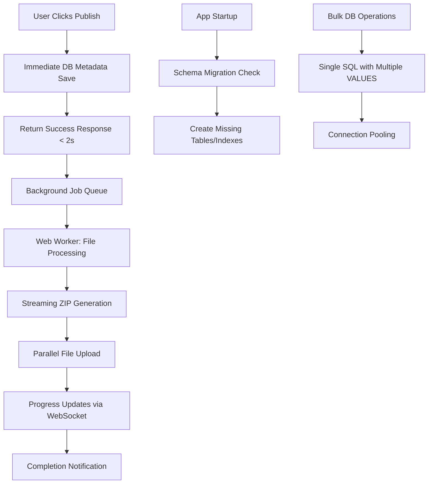

# Design Document

## Overview

This design document outlines the optimization strategy for the Steel Vault publish drawings functionality. The current system suffers from performance bottlenecks due to synchronous processing, inefficient database operations, and client-side heavy lifting. The optimized design introduces asynchronous processing, database operation batching, Web Worker utilization, and improved user feedback mechanisms.

## Architecture

### Current Architecture Issues

- DDL operations (ALTER TABLE, CREATE INDEX) executed on every API request
- Individual database queries for each drawing (N+1 problem)
- Synchronous client-side ZIP/PDF/XLSX generation blocking UI
- Large file processing in main thread causing browser freezes
- No progress feedback during long operations

### Optimized Architecture



## Components and Interfaces

### 1. Database Schema Manager

**Purpose:** Handle all DDL operations during application startup instead of per-request

**Interface:**

```javascript
class SchemaManager {
  async ensureSchemaOnStartup()
  async runMigrations()
  async validateSchema()
}
```

**Implementation:**

- Move `ensureTable()` logic to application startup
- Create migration system for schema changes
- Use database connection pooling
- Implement schema validation checks

### 2. Bulk Database Operations Service

**Purpose:** Replace individual queries with efficient bulk operations

**Interface:**

```javascript
class BulkDrawingService {
  async bulkUpsertDrawings(entries)
  async batchInsertWithConflictResolution(data)
  async optimizedProjectDrawingsQuery(filters)
}
```

**Implementation:**

- Use PostgreSQL `INSERT ... ON CONFLICT DO UPDATE` with multiple VALUES
- Implement prepared statements for better performance
- Add query result caching for frequently accessed data
- Use database transactions for consistency

### 3. Background Job Processing System

**Purpose:** Handle heavy operations asynchronously with progress tracking

**Interface:**

```javascript
class JobProcessor {
  async createJob(type, payload)
  async updateJobProgress(jobId, progress)
  async getJobStatus(jobId)
  async completeJob(jobId, result)
}
```

**Implementation:**

- Job queue using in-memory storage (Redis for production)
- WebSocket connections for real-time progress updates
- Job retry mechanism with exponential backoff
- Job cleanup and garbage collection

### 4. Web Worker File Processor

**Purpose:** Offload heavy file operations from main thread

**Interface:**

```javascript
// Main Thread
class FileProcessorManager {
  async processFiles(files, options)
  onProgress(callback)
  onComplete(callback)
  onError(callback)
}

// Worker Thread
class FileWorker {
  async generateZIP(files)
  async createPDF(data)
  async createExcel(data)
  async uploadFiles(files)
}
```

**Implementation:**

- Dedicated Web Worker for file processing
- Streaming ZIP generation using JSZip with compression
- Chunked file reading to manage memory usage
- Progress reporting back to main thread

### 5. Optimized API Routes

**Purpose:** Streamlined API endpoints with improved performance

**Routes:**

- `POST /api/project-drawings/bulk` - Bulk upsert operations
- `GET /api/project-drawings/status/:jobId` - Job status checking
- `POST /api/project-drawings/publish` - Initiate publish process
- `WebSocket /api/project-drawings/progress` - Real-time updates

**Optimizations:**

- Remove DDL operations from request handlers
- Implement response caching where appropriate
- Use database connection pooling
- Add request validation middleware

### 6. Progress Tracking UI Component

**Purpose:** Provide real-time feedback during publish operations

**Interface:**

```javascript
class PublishProgressTracker {
  showProgress(jobId)
  updateProgress(percentage, currentOperation)
  showCompletion(result)
  showError(error)
}
```

**Implementation:**

- WebSocket connection for real-time updates
- Progress bar with operation details
- Estimated time remaining calculations
- Error handling with retry options

## Data Models

### Job Tracking Model

```javascript
{
  id: string,
  type: 'publish_drawings',
  status: 'pending' | 'processing' | 'completed' | 'failed',
  progress: number, // 0-100
  currentOperation: string,
  payload: {
    clientId: number,
    projectId: number,
    packageId: number,
    drawings: Array,
    extras: Array,
    models: Array
  },
  result: {
    storagePath?: string,
    downloadUrl?: string,
    error?: string
  },
  createdAt: Date,
  updatedAt: Date,
  completedAt?: Date
}
```

### Optimized Drawing Entry Model

```javascript
{
  drawingNumber: string,
  category: string,
  revision: string,
  clientId: number,
  projectId: number,
  packageId?: number,
  lastAttachedAt: Date,
  clientRowId: string,
  meta?: object
}
```

## Error Handling

### Database Error Handling

- Connection pool exhaustion: Queue requests with timeout
- Deadlock detection: Automatic retry with exponential backoff
- Schema validation failures: Detailed error logging and user notification
- Bulk operation failures: Partial success reporting with failed item details

### File Processing Error Handling

- Memory exhaustion: Chunked processing with garbage collection
- File corruption: Validation before processing with user notification
- Upload failures: Automatic retry with progress preservation
- Web Worker crashes: Automatic restart with job recovery

### User Experience Error Handling

- Network disconnection: Offline mode with sync when reconnected
- Browser crashes: Job recovery on page reload
- Timeout handling: Extended timeout with user notification options
- Graceful degradation: Fallback to synchronous processing if needed

## Testing Strategy

### Unit Testing

- Database operation performance tests
- File processing accuracy tests
- Web Worker communication tests
- Error handling scenario tests

### Integration Testing

- End-to-end publish workflow tests
- Database bulk operation tests
- File upload and download tests
- WebSocket connection stability tests

### Performance Testing

- Load testing with multiple concurrent users
- Memory usage monitoring during large file processing
- Database query performance benchmarking
- File processing speed comparisons

### User Acceptance Testing

- Publish workflow completion time measurements
- User interface responsiveness during operations
- Error message clarity and actionability
- Progress indicator accuracy validation

## Security Considerations

### File Processing Security

- File type validation before processing
- Size limits to prevent DoS attacks
- Sanitization of file names and metadata
- Secure temporary file handling

### Database Security

- Prepared statements to prevent SQL injection
- Connection string encryption
- Access control for bulk operations
- Audit logging for data modifications

### API Security

- Rate limiting for bulk operations
- Authentication for WebSocket connections
- Input validation for all endpoints
- CORS configuration for file uploads

## Performance Targets

### Response Time Targets

- Initial publish response: < 2 seconds
- Database bulk operations: < 500ms for 100 drawings
- File processing: < 30 seconds for typical drawing sets
- Progress updates: < 100ms latency

### Resource Usage Targets

- Memory usage: < 500MB for large drawing sets
- CPU usage: < 80% during peak processing
- Database connections: < 10 concurrent connections
- Network bandwidth: Efficient streaming uploads

### Scalability Targets

- Support 50+ concurrent users
- Handle drawing sets up to 1000 items
- Process files up to 500MB total size
- Maintain performance with 10,000+ stored drawings
